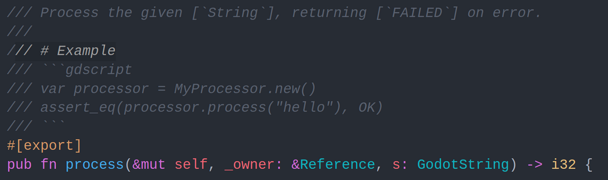
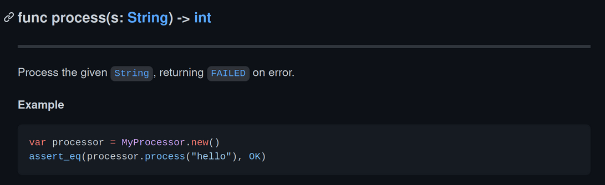
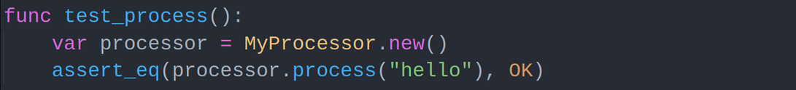

# gdnative-doc

This is a documentation tool for [godot-rust](https://github.com/godot-rust/godot-rust) projects.

**WARNING:** very unstable at the moment.

The goal of this tool is to automate writing documentation in Rust code that will be used in gdscript.

## Features

- Keep the documentation synchronized with your code.
- Build table of contents automatically.
- Automatic linking to the [godot documentation](https://docs.godotengine.org/en/stable/index.html).
- Generate [gut](https://github.com/bitwes/Gut) tests from gdscript examples.

## Example

 An example: `process` function |
 :------- |
 Input: Rust |
  |
 Output: markdown |
  |
 Output: gut |
  |

A more complete example can be found in the [example/dijkstra-map-gd](example/dijkstra-map-gd) directory.

## Usage

This is meant to be used as a build script: Set
```toml
[build-dependencies]
gdnative-doc = "*"
```
In your Cargo.toml. Then you can drive the process with the `Builder` structure:
```rust
// build.rs
use gdnative_doc::{Builder, Backend};
use std::path::PathBuf;

fn main() {
    Builder::new()
        .user_config(PathBuf::from("config.toml"))
        .add_backend(Backend::Markdown {
            output_dir: PathBuf::from("doc/markdown"),
        })
        .build()
        .unwrap();
}
```

More informations can be found in the [documentation](TODO).

The format of the configuration file can be found [here](configuration_file-format.md).

You can also use the [command-line tool](gdnative-doc-cli).

## Limitations

At the moment, [syn](https://crates.io/crates/syn) is used to parse rust and search for the `struct` and `impl`s. This is not optimal however and might sometime mess up link resolution.
[rust-analyzer](https://github.com/rust-analyzer/rust-analyzer) libraries will probably be used in the future to avoid this.